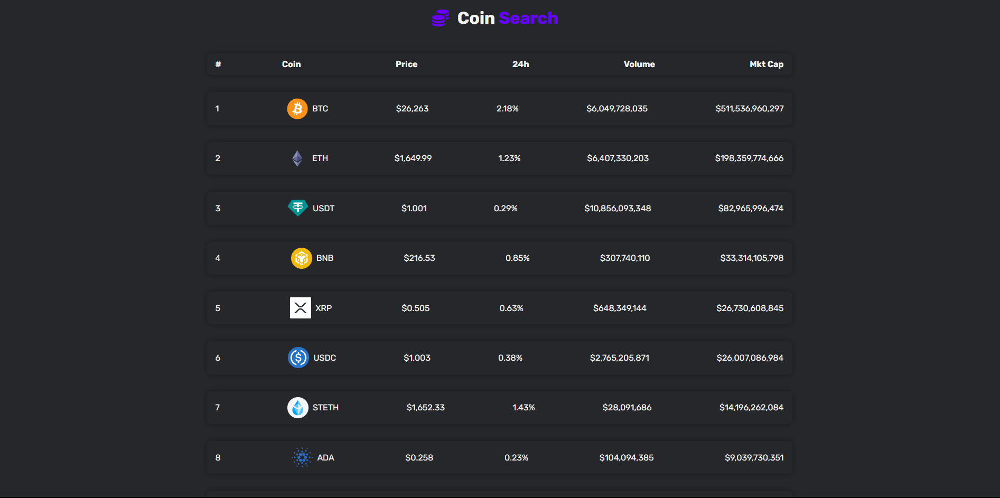

<!-- Project Screenshot -->
<p align="center">
  
</p>

<!-- Project Title -->
<h1 align="center" style="font-size: 48px; color: #333; text-shadow: 2px 2px 4px rgba(0, 0, 0, 0.2); font-family: 'Segoe UI', Tahoma, Geneva, Verdana, sans-serif;">🚀 My Super Cool Website 🚀</h1>

<!-- Project Description -->
<p align="center" style="font-size: 24px; color: #666; font-family: 'Arial', sans-serif;">Experience a stunning website showcasing my HTML, CSS, JavaScript, Tailwind CSS, and React skills with a touch of creativity.</p>

<!-- Key Features -->
<p align="center" style="font-size: 24px; color: #333; margin-top: 20px; font-family: 'Arial', sans-serif;">
  ✨ Clean Design | 📱 Responsive Layout | 💫 Smooth Animations
</p>

<!-- Technologies Used -->
<p align="center">
  
  
  
  <a href="https://reactjs.org/" target="_blank" rel="noreferrer">
    
  </a>
  
</p>


## 🚀 Get Started

### Installation

1. Clone the repository to your local machine:

   ```shell
   git clone https://github.com/ABDULLAHRH1/crypto.git
